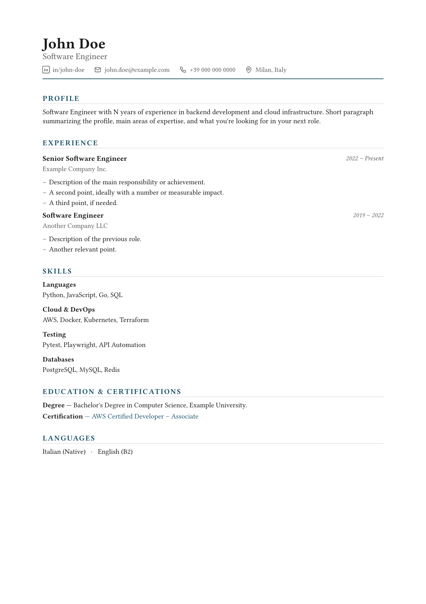
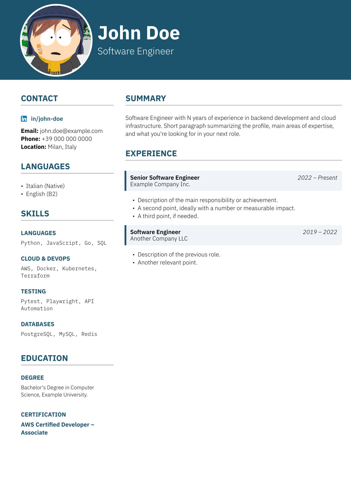

# CV Template (Typst)
Simple CV template in typst. It separates style (`template.typ`) from content (`data.yaml`).

## Preview Templates
### Default

### With sidebar



## How To Compile

```bash
typst compile main.typ                              # template clean (default)
typst compile main.typ --input template=sidebar     # template with sidebar
typst watch main.typ                                # recompile live on save (default)
 
# Image export (i've used it for readme previews)
typst compile main.typ preview.png --ppi 150

```

## How Yo Update
Often it should be enough to edit `data.yaml`, depending on the content you might need to adjust the style:

```yaml
experience:
  - title: "New Role"
    company: "New Company"
    date: "2026 – Now"
    bullets:
      - "What you did."
      - "Other thing."
```
Adding new experience means adding a block in the list without touching `template.typ`.

### Fonts
Fonts are configurable in the same `data.yaml` file (check `data.example.yaml`), you can use any font installed on your system
```yaml
font: "Libertinus Serif"
font-mono: "DejaVu Sans Mono"
```

## Note on images

`cv_avatar.jpg` and `linkedin-icon.png` here are **placeholders** generated only for compile testing. Replace them with your own (same name, or update the path in `data.yaml`, field `photo`).
